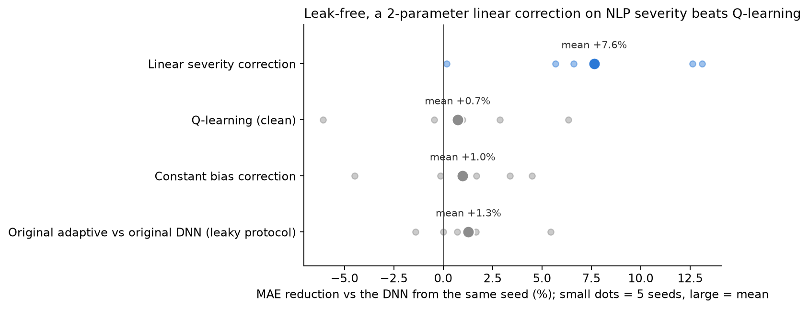
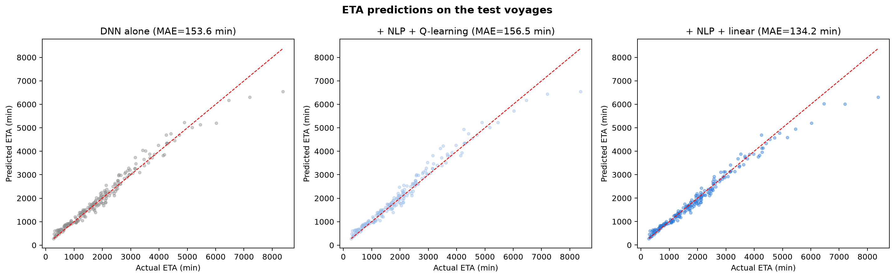

# Adaptive ETA Prediction for Inland Waterway Cargo

**Riyan Wankhede | 23BCE9287 | VIT-AP University**

An end-to-end machine learning pipeline for predicting and adaptively adjusting Estimated Time of Arrival (ETA) for inland waterway cargo vessels, combining deep learning, NLP, and reinforcement learning.

**Result (leak-free, 5 seeds, 1,000 synthetic voyages):** delay severity extracted from operational text is a useful signal.
A two-parameter linear correction on it lowers the network's ETA error by **7.6 %** on average. The Q-learning layer does **not**
give a reliable gain once the evaluation leaks found in an [audit](evaluation_audit.ipynb) are removed (+0.7 % ± 4.6 %).

---

## Overview

Traditional ETA systems rely only on structured numerical data and produce static predictions. This system integrates three components to handle dynamic operational conditions reported through unstructured text (captain logs, port authority messages, maintenance reports).

---


## Architecture


### 1. Base ETA Prediction (Deep Learning)

- PyTorch MLP: `Input(5) → 128 → 64 → 32 → Output(1)`
- Batch normalisation + dropout at each hidden layer
- Trained on 5 structured features: distance, vessel speed, river current, weather severity, port congestion
- Original single-seed result: test MAE 137.89 min, R² 0.9773 (early stopping monitored the test set; see the audit below)


### 2. Delay Signal Extraction (NLP)

- Three-tier pipeline: phrase shortcuts → 35-keyword weighted average → DistilBERT fallback
- Outputs a delay severity score between 0 and 1
- Example keywords: `storm → 1.0`, `congestion → 0.9`, `fog → 0.8`, `smooth → 0.1`


### 3. Adaptive ETA Adjustment (Reinforcement Learning)

- Q-Learning agent with 210 states (10 ETA bins × 21 severity bins)
- 5 discrete actions: `[0%, 2%, 5%, 10%, 20%]` ETA increase
- Reward: `r = (|err_base| − |err_adj|) / base_eta`
- Trained over 5,000 episodes with ε-greedy exploration (ε: 1.0 → 0.05)
- Original single-seed result: MAE 135.61 min, R² 0.9801, MAE Δ −1.65 % (leaky protocol; see the audit below)

---


## Results (evaluation audit)

[`evaluation_audit.ipynb`](evaluation_audit.ipynb) replays this project's own code and re-evaluates it over 5 random seeds
with a leak-free protocol. It found three problems in the original evaluation:

1. **The test-time correction used the true arrival time.** Each test voyage's severity was derived from
   `actual_eta − base_eta`, i.e. from the value being predicted, instead of from the operational log.
2. **The Q-learning agent was trained on all voyages**, including the 200 test voyages.
3. **Early stopping monitored the test set**, which made the DNN look 5.8 % better than proper validation does.

Leak-free protocol: train / validation / test = 640 / 160 / 200; early stopping on validation; the agent trains on training
voyages only; every voyage's severity comes from its matched log text. Gains are paired against the DNN from the same seed.

| Method | MAE (min), mean ± sd | Gain vs DNN, mean ± sd |
| --- | --- | --- |
| DNN alone | 152.9 ± 16.4 | — |
| + constant bias correction (no text) | 151.5 ± 17.7 | +1.0 % ± 3.5 % |
| + NLP severity → Q-learning | 151.5 ± 15.0 | +0.7 % ± 4.6 % |
| **+ NLP severity → linear correction** | **141.5 ± 19.6** | **+7.6 % ± 5.4 %** |



**What this means:** the text-derived severity signal works. The adjustment is a single decision per voyage with no next
state (a contextual bandit, not a sequential RL problem), so a direct regression on severity uses the signal better than
five discrete actions over 210 states. The linear correction beats Q-learning in 4 of 5 seeds.

**Original published results** (single seed, protocol above not yet fixed; reproduced exactly by the audit):

| Metric    | Base DNN | Adaptive (RL) |
| --------- | -------- | ------------- |
| MAE (min) | 137.89   | 135.61        |
| R²        | 0.9773   | 0.9801        |
| MAE Δ (%) | -        | -1.65%        |



With other seeds, the same original notebook gives gains from −1.4 % to +5.4 %. The main notebook is left unchanged so the
paper's numbers stay reproducible; a note at its evaluation cell points to the audit.

---


## Project Structure

```
├── Adaptive_ETA_Prediction.ipynb          # Main notebook (end-to-end pipeline)
├── evaluation_audit.ipynb                 # Leak-free re-evaluation over 5 seeds (~1 min on CPU)
├── results/evaluation_audit.csv           # Per-seed numbers behind the audit table
├── Research_Paper.pdf                     # IEEE-format research paper
├── Adaptive_ETA_Prediction_Slides.pdf     # Presentation slides
├── ETA_Prediction_Architecture.html       # Interactive system overview (open in a browser)
├── figures/                               # Every figure the notebook saves
├── models/                                # Trained DNN, scalers and Q-table
├── requirements.txt                       # Python dependencies
└── README.md
```

---


## Setup

```bash
pip install -r requirements.txt
```

Then open and run `Adaptive_ETA_Prediction.ipynb` top to bottom.

**Requirements:** Python 3.8+, PyTorch, Transformers (HuggingFace), scikit-learn, pandas, numpy, matplotlib

---


## Key Concepts

- **Synthetic dataset** of 1,000 inland waterway voyages
- **Latent severity** variable in dataset used only for RL reward evaluation (not fed to DNN)
- **NLP + RL integration**: NLP severity score forms part of the RL state representation
- Q-table persisted across episodes for stable convergence

---


## Citation

If you use this work, please cite:

> Wankhede, R. (2026). *Adaptive ETA Prediction for Inland Waterway Cargo Using Machine Learning, NLP, and Reinforcement Learning*. VIT-AP University.

---


## License

MIT