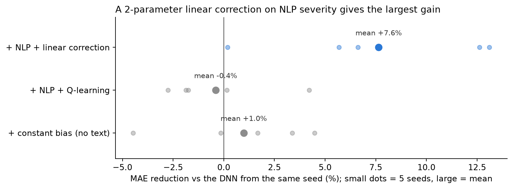
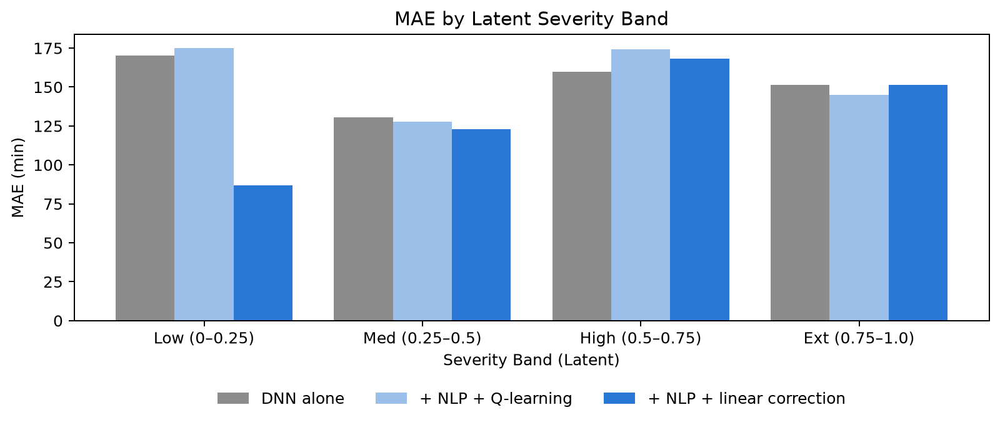

# Adaptive ETA Prediction for Inland Waterway Cargo

**Riyan Wankhede | 23BCE9287 | VIT-AP University**

An end-to-end machine learning pipeline for predicting and adaptively adjusting Estimated Time of Arrival (ETA) for inland
waterway cargo vessels, combining deep learning, NLP, and reinforcement learning.

**Result (5 seeds, 1,000 synthetic voyages):** delay severity extracted from operational text is a useful signal. A
two-parameter linear correction on it lowers the network's ETA error by **7.6 %** on average, while a Q-learning agent using
the same signal does not improve on the network (−0.4 % ± 2.8 %).



---


## Overview

Traditional ETA systems rely only on structured numerical data and produce static predictions. This system adds a signal
from unstructured operational text (captain logs, port authority messages, maintenance reports) and compares two ways of
using it to correct the network's prediction: a Q-learning agent and a linear correction.

---


## Architecture


### 1. Base ETA Prediction (Deep Learning)

- PyTorch MLP: `Input(5) → 128 → 64 → 32 → Output(1)`, batch normalisation + dropout at each hidden layer, MSE loss
- Trained on 5 structured features: distance, vessel speed, river current, weather severity, port congestion
- Early stopping on a held-out validation split


### 2. Delay Signal Extraction (NLP)

- Three-tier pipeline: 8 clear-condition phrases → weighted average over a 33-keyword lexicon → DistilBERT sentiment fallback
- Outputs a delay severity score between 0 and 1
- Example keywords: `storm → 1.0`, `congestion → 0.9`, `fog → 0.8`, `smooth → 0.05`


### 3. Adaptive ETA Adjustment

- **Q-learning:** 210 states (10 ETA bins × 21 severity bins), 5 actions `[0%, 2%, 5%, 10%, 20%]` ETA increase,
reward `r = (|err_base| − |err_adj|) / base_eta`, 5,000 one-step episodes (each voyage is a single decision) with
ε-greedy exploration (ε: 1.0 → 0.05)
- **Linear correction:** `ETA × (1 + a + b · severity)`, with `a` and `b` fitted by least squares on training voyages
- **Constant bias correction** (no text) as a control: one multiplicative factor fitted on training voyages

---


## Evaluation protocol

- Train / validation / test = 640 / 160 / 200 voyages; the test set is never used for training or model selection
- The Q-learning agent and both corrections are fitted on training voyages only
- Every voyage's delay severity comes from its log text, never from its true arrival time
- `[multi_seed_evaluation.ipynb](multi_seed_evaluation.ipynb)` repeats the full pipeline with 5 seeds; gains are paired
against the DNN from the same seed, because the absolute MAE varies by about ±16 minutes between seeds


## Results


| Method                                 | MAE (min), mean ± sd | Gain vs DNN, mean ± sd |
| -------------------------------------- | -------------------- | ---------------------- |
| DNN alone                              | 152.9 ± 16.4         | —                      |
| + constant bias correction (no text)   | 151.5 ± 17.7         | +1.0 % ± 3.5 %         |
| + NLP severity → Q-learning            | 153.7 ± 19.0         | −0.4 % ± 2.8 %         |
| **+ NLP severity → linear correction** | **141.5 ± 19.6**     | **+7.6 % ± 5.4 %**     |


The linear correction beats Q-learning in 4 of 5 seeds. The adjustment is a single decision per voyage with no next state
(a contextual bandit, not a sequential RL problem), so a direct regression on severity uses the signal better than five
discrete actions over 210 states. The constant correction recovers only a small part of the gain, so the improvement comes
from the text signal rather than from fixing an overall bias.



In the main notebook's run (seed 42), most of the linear correction's gain comes from low-disruption voyages, where the
network over-predicts (MAE 170 → 87 min).

## Limitations

- The dataset is synthetic. Each voyage's log text is drawn from a fixed pool of 20 messages matched to a hidden disruption
level, so the NLP signal is cleaner than real operational text would be.
- The NLP severity scores have not been validated against human annotations.
- Results are from 5 seeds on 200 test voyages each; the spread across seeds is large relative to the effects.

---


## Project Structure

```
├── Adaptive_ETA_Prediction.ipynb          # Main notebook: end-to-end pipeline, one seed (~30 s on CPU)
├── multi_seed_evaluation.ipynb            # Same pipeline over 5 seeds (~1 min on CPU)
├── results/multi_seed_results.csv         # Per-seed numbers behind the results table
├── figures/                               # Every figure the notebooks save
├── models/                                # Trained DNN, scalers, Q-table and linear correction (written by Cell 19)
├── Research_Paper.pdf                     # IEEE-format research paper
├── ETA_Prediction_Architecture.html       # Interactive system overview (open in a browser)
├── requirements.txt                       # Python dependencies
└── README.md
```

---


## Setup

```bash
pip install -r requirements.txt
```

Then open and run `Adaptive_ETA_Prediction.ipynb` top to bottom. The first run downloads DistilBERT (~260 MB) for the NLP
demo's Tier-3 examples.

**Requirements:** Python 3.9+, PyTorch, Transformers (HuggingFace), scikit-learn, pandas, numpy, matplotlib

---


## Key Concepts

- **Synthetic dataset** of 1,000 inland waterway voyages
- **Latent severity**: a hidden disruption level that adds 0–30 % travel time. It is never fed to the DNN; it selects each
voyage's simulated log text, and that text's NLP severity is what the corrections see
- **NLP + RL integration**: the NLP severity score is part of the Q-learning state, and the input to the linear correction

---


## Citation

If you use this work, please cite:

> Wankhede, R. (2026). *Adaptive ETA Prediction for Inland Waterway Cargo Using Machine Learning, NLP, and Reinforcement Learning*. VIT-AP University.

---


## License

MIT